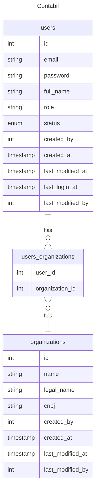

# Contabil

## TODO

- [x] login
- [x] users table
- [x] organizations table
- [x] users x organizations
- [ ] movimento table
- [ ] organizations x movimento
- [ ] users x organizations x movimento authorization
- [x] organizations page
- [ ] movimento page
- [ ] user add
- [ ] user edit
- [ ] organization add
- [ ] organization edit
- [ ] movimento add
- [ ] movimento edit
- [ ] audit table
- [x] add spring boot devtools
- [ ] add pagination to queries and repositories
- [ ] add header to pages
- [ ] add footer to pages
- [ ] add menu to pages
- [ ] add css framework - bootstrap or material
- [ ] add table handler to pages

> [!TIP]
> [Access this docs for readme.md markdown syntax](https://docs.github.com/pt/get-started/writing-on-github/getting-started-with-writing-and-formatting-on-github/basic-writing-and-formatting-syntax)

## Reference

### SQL

* https://www.w3schools.com/sql/sql_join_inner.asp

> Select all users from School A

```sql
select * from users 
inner join users_organizations 
  on users.id = users_organizations.user_id 
inner join organizations 
  on users_organizations.organization_id = organizations.id
where organizations.id = 1;
```

### SQL Diagram

