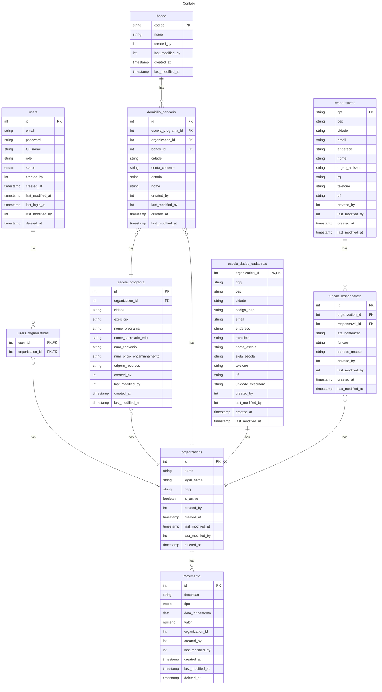

# Contabil

## TODO

- [x] login
- [ ] login page
- [x] users table
- [x] organizations table
- [x] movimento table
- [x] users x organizations
- [x] organizations x movimento
- [x] users x organizations x movimento authorization
- [x] users page
- [x] organizations page
- [x] movimento page
- [x] user add
- [x] user edit
- [x] user view
- [x] user delete
- [x] user password change
- [x] organization add
- [x] organization edit
- [x] organization view
- [ ] movimento add
- [ ] movimento edit
- [ ] audit table
- [x] add spring boot devtools
- [ ] add pagination to queries and repositories
- [x] add header to pages
- [ ] add footer to pages
- [x] add sidebar menu
- [x] fix sidebar
- [x] add css framework - bootstrap or material
- [ ] add table handler to pages
- [x] disable organization page
- [x] select organization page
- [x] exported files page
- [x] add EscolaDadosCadastrais table
- [x] add EscolaDadosCadastrais view page
- [ ] add EscolaDadosCadastrais edit page
- [x] add Rol de Responsáveis page
- [ ] add Rol de Responsáveis view page
- [ ] add Rol de Responsáveis edit page
- [ ] add Rol de Responsáveis delete page
- [x] add Domicílio Bancário page
- [ ] add Domicílio Bancário view page
- [ ] add Domicílio Bancário edit page
- [ ] add Domicílio Bancário delete page
- [ ] add Escola Programa page
- [ ] add Escola Programa view page
- [ ] add Escola Programa edit page
- [ ] add Escola Programa delete page


> [!TIP]
> - [Access this docs for readme.md markdown syntax](https://docs.github.com/pt/get-started/writing-on-github/getting-started-with-writing-and-formatting-on-github/basic-writing-and-formatting-syntax)
> - [Code blocks with syntax highlighting](https://docs.github.com/en/get-started/writing-on-github/working-with-advanced-formatting/creating-and-highlighting-code-blocks)
> - [Tables on readme.md syntax](https://docs.github.com/en/get-started/writing-on-github/working-with-advanced-formatting/organizing-information-with-tables)
> - [Docs for diagrams on readme.md, Mermaid syntax](https://docs.github.com/en/get-started/writing-on-github/working-with-advanced-formatting/creating-diagrams)
> - [Mermaid syntax](https://mermaid.js.org/syntax/entityRelationshipDiagram.html)

## Reference

### Thymeleaf

- [Thymeleaf + Spring](https://www.thymeleaf.org/doc/tutorials/3.1/thymeleafspring.html)
- [Using thymeleaf](https://www.thymeleaf.org/doc/tutorials/3.0/usingthymeleaf.html)

### Spring

- [Spring Framework](https://spring.io/)
- [Spring Data JPA](https://docs.spring.io/spring-data/jpa/reference/jpa.html)
- [Spring Security](https://docs.spring.io/spring-security/reference/index.html)

### SQL

* https://www.w3schools.com/sql/sql_join_inner.asp

> Select all users from School A

```sql
select * 
from users 
inner join users_organizations 
  on users.id = users_organizations.user_id 
inner join organizations 
  on users_organizations.organization_id = organizations.id
where 
  organizations.id = 1;
```

### SQL Diagram

